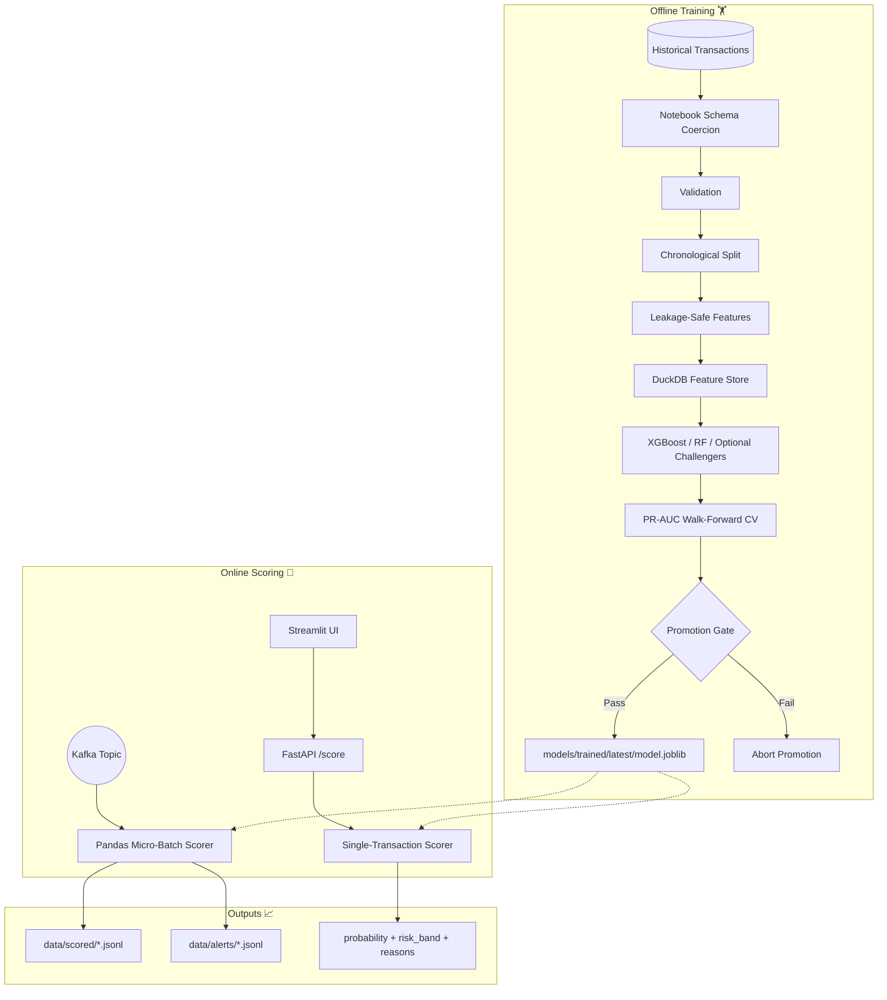

# 💳 Credit Card Fraud Detection Platform

A production-style fraud detection platform based on the Capital One-style transaction dataset.
The project turns the notebook workflow into a **deployable, resilient, and observable system** with:

⚙️ *Schema Governance* · 🛡️ *Leakage-safe Features* · 🗃️ *DuckDB Feature Store* · 🧠 *Model Training* · 🌊 *Kafka Micro-batch Scoring* · 🚀 *FastAPI Serving* · 🖥️ *Streamlit UI* · 🐳 *Docker & K8s* · 🤖 *CI/CD*

---

## 🏗️ System Architecture



## ✨ Core Pillars

| Capability | Implementation | 💡 Benefit |
| :--- | :--- | :--- |
| **Training-serving parity** | `schemas.py`, `validation.py`, `features.py` | Eliminates training-production drift. |
| **Leakage control** | Chronological split | Ensures realistic evaluation. |
| **Rare-event evaluation** | PR-AUC optimization | Focuses on detection accuracy where it matters. |
| **Operational explainability** | Risk bands & reason strings | Helps analysts triage alerts faster. |

## 📊 Sample Output (Terminal)

```text
$ fraud stream --config base
[2026-05-18 10:00:01] INFO: Initializing scorer...
[2026-05-18 10:00:05] INFO: Consumed batch: 150 transactions
[2026-05-18 10:00:06] INFO: Scored: 150 | Fraud: 3 | Risk: 🔥 High
[2026-05-18 10:00:06] INFO: Alerting: 3 records written to data/alerts/20260518.jsonl
------------------------------------------------------------
| Fraud Score | Risk Band | Top Reason                           |
------------------------------------------------------------
| 0.98        | 🔥 High   | Abnormal amount, Card not present    |
| 0.85        | ⚠️ Medium | New merchant, Cross-border           |
| 0.45        | 🟢 Low    | None                                 |
------------------------------------------------------------
```

## 📂 Project Structure

```text
📁 docker/                   🐳 Runtime images
📄 docs/architecture.md      🏗️ System deep-dive
⚙️ scripts/run_ui.py         🖥️ Streamlit launcher
📂 src/fraud_detection/
  📄 cli.py                  ⚡ Unified `fraud` CLI
  ⚙️ configs/                🧩 Runtime YAML configs
  🧬 feature_transforms/     🧪 Modular feature engineering
  🧠 models/                 🤖 Registered model components
  🛠️ jobs/                   🚀 Production entrypoints
  ⚙️ pipeline/               ✅ Data validation & modeling
☸️ k8s/                      ☸️ K8s manifests
🧪 tests/                    ✅ Unit & integration tests
```

## 🚀 Getting Started

1. **Setup Env** 🛠️:
   ```bash
   python -m venv .venv
   source .venv/bin/activate
   pip install -e ".[dev,stream,api,ui]"
   ```

2. **Train Model** 🏋️:
   ```bash
   fraud train --config base
   ```

3. **Run Pipeline** 🌊:
   ```bash
   docker compose up -d zookeeper kafka
   fraud stream --config base
   ```

---
*For a full graph-based analysis of the codebase, see [graphify-out/GRAPH_REPORT.md](./graphify-out/GRAPH_REPORT.md).*
