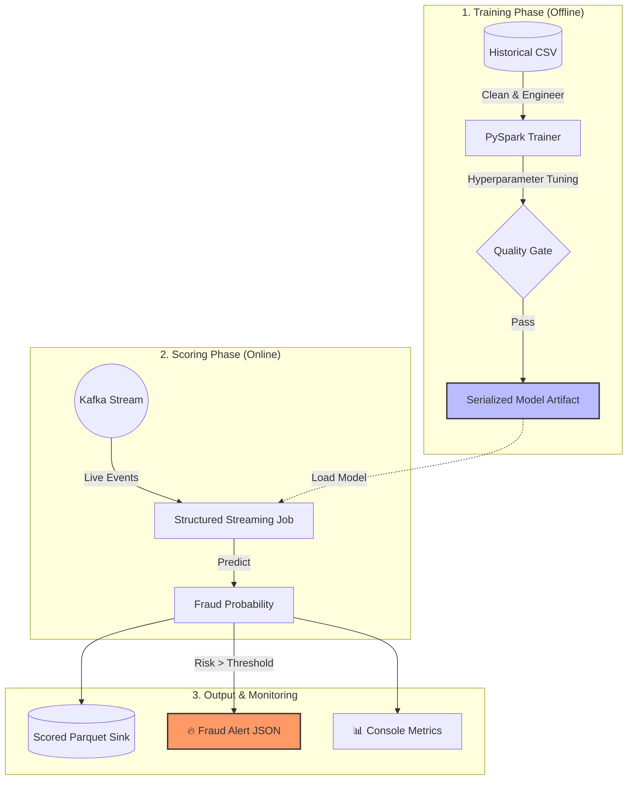

# 🛡️ Credit Card Fraud Detection Pipeline

[](https://spark.apache.org/)
[](https://kafka.apache.org/)
[](https://fastapi.tiangolo.com/)

A **production-grade** real-time fraud detection engine. This isn't just a model; it's a complete ecosystem designed to train, score, and alert at scale using the modern Big Data stack.

---

## 📽️ System Architecture

Understanding the flow is easy. We move from **Historical Insights** to **Real-Time Actions**:



---

## 🚀 Key Features

| Feature | Description |
| :--- | :--- |
| **Unified Logic** | Exactly the same feature engineering used for both Training and Streaming. No skew! |
| **Quality Gates** | Automatic AUC-ROC validation (>= 0.85) before any model is promoted. |
| **Dual-Path Scoring** | Choose between **High-Throughput Streaming** or **Low-Latency REST API**. |
| **Fault Tolerant** | Built-in Spark checkpointing and Kafka replay support. |

---

## 📂 Project Structure

> [!TIP]
> Explore the codebase like a pro by following this layout:

- ⚙️ **`configs/`**: The brain of the operation. Define paths and hyperparams here.
- 🏗️ **`src/fraud_detection/`**: The core engine.
  - 🧪 **`pipeline/`**: Logic for validation and modeling.
  - ⚡ **`jobs/`**: The actual workers (Trainer, Streamer, API).
- 🧪 **`tests/`**: Battle-testing every component.
- 🐳 **`docker-compose.yml`**: Launch the entire universe with one command.

---

## 🛠️ Getting Started

### 1. The Fast Path (Docker)
Launch the full stack including Kafka, HDFS, and Spark:
```bash
docker compose up --build
```

### 2. The Developer Path (Local)
```bash
make install-dev
make train      # Train the model
make stream     # Start scoring live events
```

> [!IMPORTANT]
> **Prerequisites**: Ensure you have Java 17+ installed if running outside Docker.

---

## 📈 Operational Monitoring

Once running, check these directories for live results:
- 🎯 **Scored Events**: `data/scored/`
- 🚨 **High-Risk Alerts**: `data/alerts/`
- 📊 **Model Metrics**: `data/metrics/`

---

## 🔗 Documentation
- [📘 Quickstart Guide](./QUICKSTART.md) - Get running in 2 minutes.
- [🗺️ Codebase Roadmap](./CODEBASE_GUIDE.md) - Where to look first.
- [🏛️ Architecture Deep-Dive](./docs/architecture.md) - How it all fits together.

---
*Built with ❤️ for High-Performance Engineering.*
