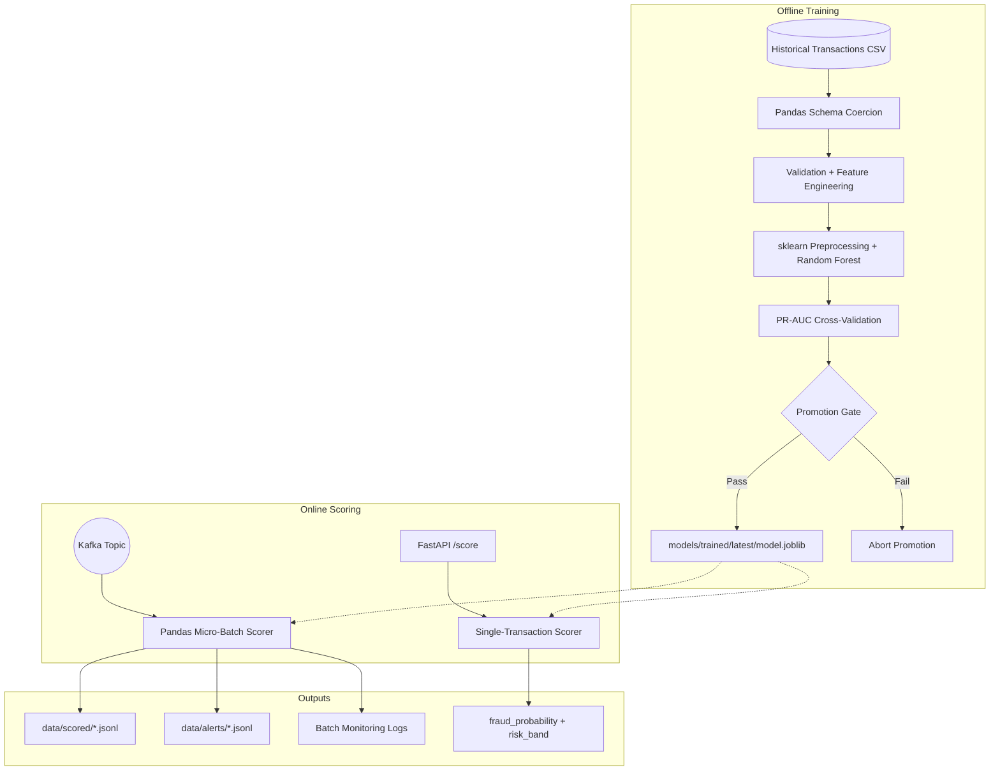

# Credit Card Fraud Detection Pipeline

[](https://pandas.pydata.org/)
[](https://scikit-learn.org/)
[](https://kafka.apache.org/)
[](https://fastapi.tiangolo.com/)

An end-to-end fraud detection system built around Pandas feature engineering, a persisted
scikit-learn model pipeline, Kafka micro-batch scoring, and a low-latency FastAPI scoring path.
The design emphasizes the parts that matter in a senior data science interview: training-serving
parity, rare-event evaluation, explicit quality gates, reproducible artifacts, and operationally
simple deployment.

## System Architecture



## What Makes This Production-Oriented

| Capability | Implementation |
| :--- | :--- |
| Training-serving parity | `features.py` and `schemas.py` are reused by training, API scoring, and stream scoring. |
| Rare-event evaluation | Model selection optimizes average precision / PR-AUC instead of accuracy. |
| Promotion control | Training refuses to save weak models when PR-AUC or recall misses the quality gate. |
| Imbalance handling | Random Forest uses class weighting plus sample weights from observed fraud skew. |
| Unknown category safety | The sklearn pipeline uses imputation and one-hot encoding with unknown handling. |
| Simple serving artifact | The full preprocessing + model pipeline is saved as `model.joblib`. |
| Operational paths | Supports batch training, Kafka micro-batch scoring, and synchronous REST scoring. |

## Project Structure

```text
configs/                  Runtime paths, thresholds, and model hyperparameters
docker/                   Lightweight Python images for trainer and scorer
docs/architecture.md      Operational architecture and extension notes
scripts/                  Thin CLI wrappers
src/fraud_detection/
  features.py             Shared Pandas feature engineering
  schemas.py              Canonical transaction schema coercion
  pipeline/
    validation.py         Data quality checks
    modeling.py           sklearn pipeline and model persistence
    metrics.py            Fraud-focused evaluation and scoring helpers
  jobs/
    train.py              Offline trainer with CV and promotion gate
    streaming.py          Kafka/CSV micro-batch scorer
    api.py                FastAPI scoring endpoint
tests/                    Unit and integration coverage
```

## Getting Started

Install the local development environment:

```bash
python -m venv .venv
source .venv/bin/activate
pip install --upgrade pip
pip install -e ".[dev,stream,api]"
```

Train and promote a model:

```bash
python scripts/train_model.py --config configs/base.yaml
```

Run the scorer and produce sample traffic:

```bash
docker compose up -d zookeeper kafka
python scripts/run_streaming_job.py --config configs/base.yaml
python scripts/produce_events.py --config configs/base.yaml --records 1000 --delay-seconds 0.02
```

Or run the containerized demo:

```bash
docker compose up --build
```

## Outputs

- `models/trained/latest/model.joblib`: promoted sklearn preprocessing + model artifact
- `data/metrics/latest_metrics.json`: ROC-AUC, PR-AUC, F1, precision, recall, and confusion counts
- `data/scored/*.jsonl`: scored transactions with probabilities and risk bands
- `data/alerts/*.jsonl`: transactions above the fraud probability threshold

## Quality Checks

```bash
pytest
ruff check .
mypy src
```

## Documentation

- [Quickstart Guide](./QUICKSTART.md)
- [Codebase Roadmap](./CODEBASE_GUIDE.md)
- [Architecture Deep-Dive](./docs/architecture.md)
