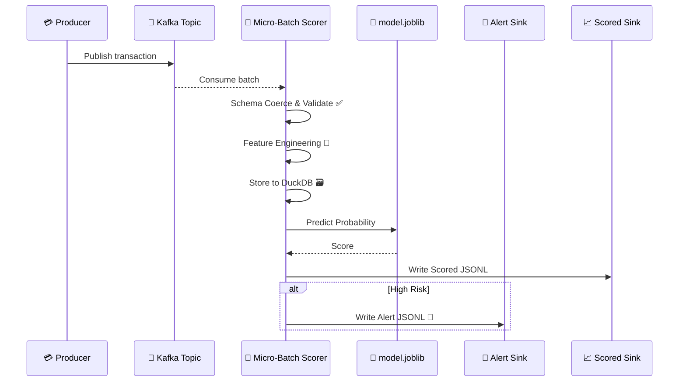
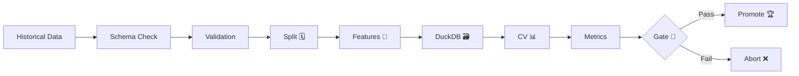

# 🏗️ Architecture & Operations

The system is organized around one invariant: the notebook transaction schema, validation rules,
feature builders, DuckDB feature-store contract, and persisted model artifact are reused anywhere
a transaction is scored.

---

## 🔄 Event Lifecycle



---

## 🏋️ Training Lifecycle



---

## 📑 Core Components

### 🧠 Model Pipeline
The persisted artifact stores the **sklearn-compatible** pipeline + metadata:
*   📋 Schema version
*   📊 Feature list
*   🚦 Threshold
*   ✅ Metrics
*   🧠 Model family & training mode
*   🎯 Fitted entity encoders

### 🧬 Feature Pipeline
Built from testable components:
*   📜 `TransactionHistoryFeature` (velocity, recency)
*   ⏰ `TemporalFeature` (time flags)
*   🧑‍ `AccountAgeFeature` (tenure)
*   💰 `AmountRatioFeature` (utilization)
*   🚨 `TransactionRiskFeature` (CVV/POS flags)
*   🎯 `EntityEncodingFeature` (fraud-rate encodings)

---

## 📊 System Insights (Graph Analysis)

The codebase has been analyzed for architectural complexity.

> **Key Findings:**
> *   `main()` is the primary orchestrator, linking ingestion, feature engineering, and training.
> *   The "Shared Training and Serving Contract" is the project's most critical high-level abstraction.
> *   Testing is heavily driven by fixtures that mirror the notebook transaction schema.
>
> *For detailed community hubs and edge dependencies, see [graphify-out/GRAPH_REPORT.md](../graphify-out/GRAPH_REPORT.md).*

---

## 🌐 Serving Surfaces

| Interface | Usage |
| :--- | :--- |
| **FastAPI** | `/health`, `/metadata`, `/score` |
| **Kafka** | Micro-batch ingestion/scoring |
| **Streamlit** | Analyst console |
| **K8s** | Scalable deployment |

*For runtime usage, refer to the unified `fraud` CLI:*
```bash
fraud train --config base
fraud stream --config base
fraud api --config base --host 0.0.0.0 --port 8000
fraud ui
```
