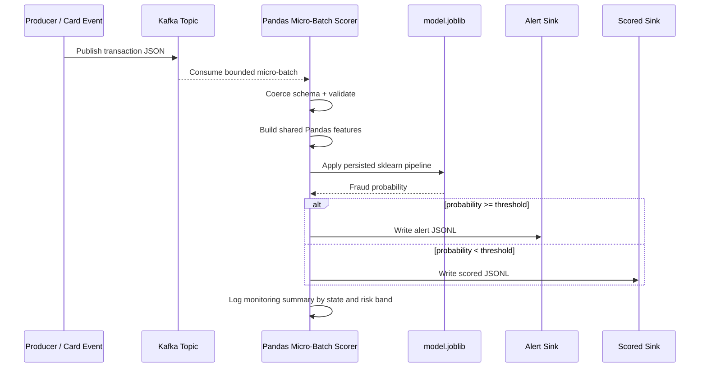
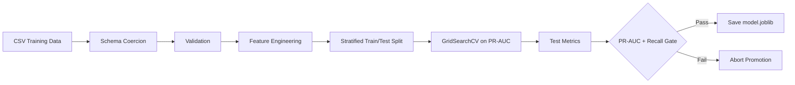

# Architecture & Operations

The system is organized around one invariant: the same schema, validation, feature engineering,
and sklearn pipeline are used everywhere a transaction is scored.

## Event Lifecycle

## Training Lifecycle

## Canonical Schema

| Category | Fields | Usage |
| :--- | :--- | :--- |
| Identity | `cc_num`, `merchant`, `trans_num` | Validation, auditability, merchant signal. |
| Temporal | `trans_date_trans_time`, `unix_time`, `dob` | Age, hour, day-of-week, night flag. |
| Geospatial | `lat`, `long`, `merch_lat`, `merch_long` | Customer-to-merchant distance. |
| Financial | `amt` | Transaction amount and validation. |
| Context | `category`, `gender`, `state`, `job`, `city_pop` | Categorical and numeric model features. |
| Label | `is_fraud` | Training and offline evaluation only. |

## Model Pipeline

The persisted sklearn artifact includes:

- categorical imputation
- one-hot encoding with unknown-category handling
- numeric median imputation
- weighted Random Forest classifier

Because preprocessing is inside the saved artifact, the API and streaming scorer do not need to
recreate training-time encoders manually.

## Evaluation Strategy

Fraud is a rare-event classification problem, so the system does not optimize for accuracy.

- `average_precision` / PR-AUC is used during cross-validation.
- ROC-AUC is still reported, but it is not the primary promotion signal.
- Precision, recall, F1, true positives, false positives, true negatives, and false negatives are
  written to `data/metrics/latest_metrics.json`.
- The promotion gate blocks model saves when PR-AUC or recall is too weak.

## Operational Notes

- Kafka offsets should be externally managed for production-grade replay guarantees.
- JSONL sinks are intentionally simple for local demos; production sinks would usually be object
  storage, a warehouse table, or a feature/alert service.
- The fraud probability threshold should be tuned against business costs, not guessed from model
  metrics alone.
- Drift monitoring should compare live feature distributions and score distributions against the
  training baseline.

## Extension Points

- Add cardholder velocity features such as spend in the last 1 hour, merchant count in the last
  24 hours, and distance from previous transaction.
- Add calibration if downstream teams need probabilities that map tightly to observed fraud rates.
- Add a model registry layer to track artifact versions, thresholds, and metric snapshots.
- Add a backfill job that scores historical data for threshold analysis and analyst review.
