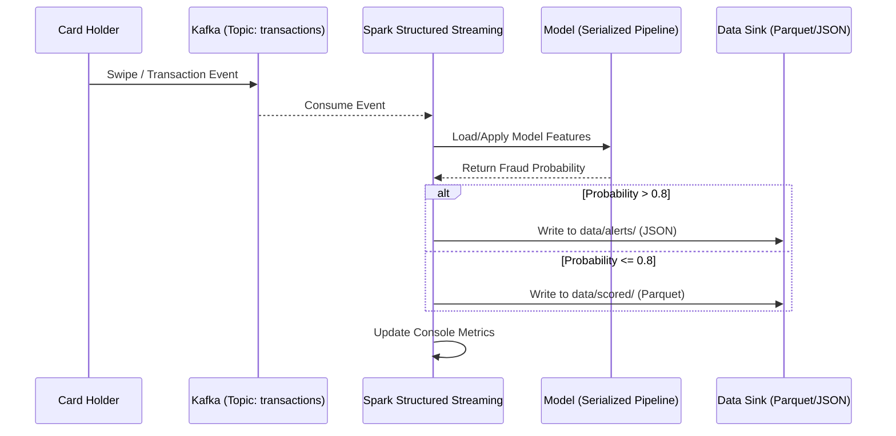

# 🏛️ Architecture & Operations

Detailed breakdown of how the Fraud Detection Pipeline functions at scale.

---

## 🔄 Event Lifecycle (Sequence)

This diagram shows how a single transaction travels from a card swipe to an automated alert.

---

## 📋 Data Dictionary (Canonical Schema)

We enforce a strict schema defined in `src/fraud_detection/schemas.py`.

| Category | Fields | Importance |
| :--- | :--- | :--- |
| **Identity** | `cc_num`, `merchant`, `trans_num` | Critical for tracking and auditing. |
| **Temporal** | `unix_time`, `trans_date_trans_time` | Used for "Time-of-day" feature engineering. |
| **Geospatial** | `lat`, `long`, `merch_lat`, `merch_long` | Used to calculate distance to merchant. |
| **Financial** | `amt` | The transaction value. |
| **Context** | `category`, `gender`, `job`, `city_pop` | Categorical context for the Random Forest. |

---

## 🛠️ Operational Best Practices

> [!CAUTION]
> **State Management**: Streaming checkpoints must live on **durable storage** (HDFS/S3) in a real production environment. Local storage will lose state on container restart.

### Key Tuning Knobs
- **Kafka Retention**: Should be at least 2x the model retraining cycle.
- **Watermarking**: Set in `configs/base.yaml` to handle late-arriving events.
- **Thresholds**: The 0.8 fraud probability threshold should be adjusted based on the cost of **False Positives** vs **False Negatives**.

---

## 🚀 Future Extensions
- 🏦 **Feature Store**: Integrate Tecton or Feast for historical cardholder aggregates.
- 📡 **Webhooks**: Send high-risk alerts directly to a PagerDuty or Slack webhook.
- 📈 **Drift Monitoring**: Add a job to compare training distributions vs serving distributions.

